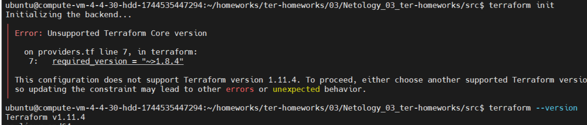
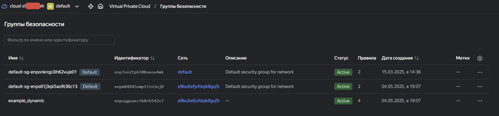
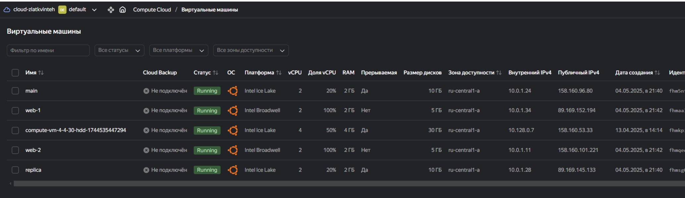
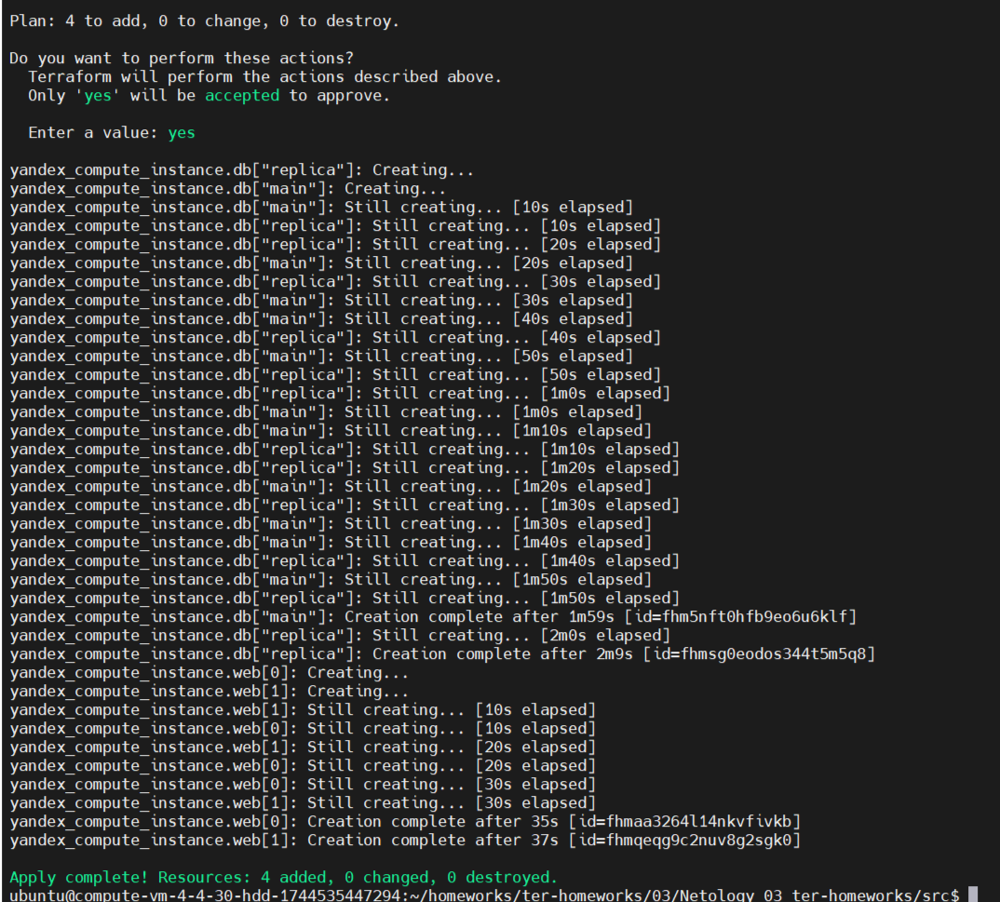
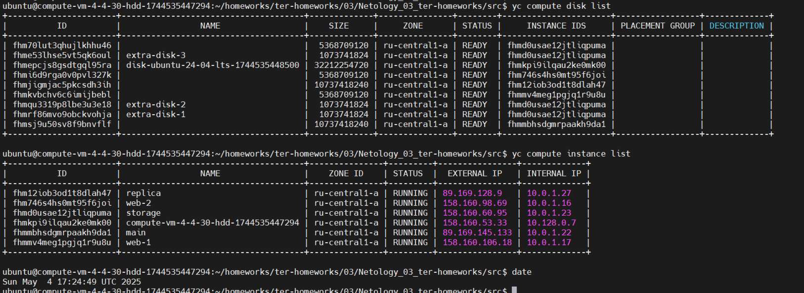
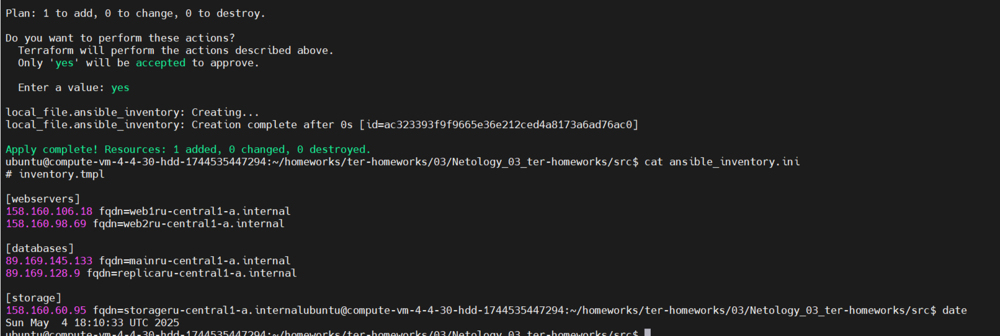
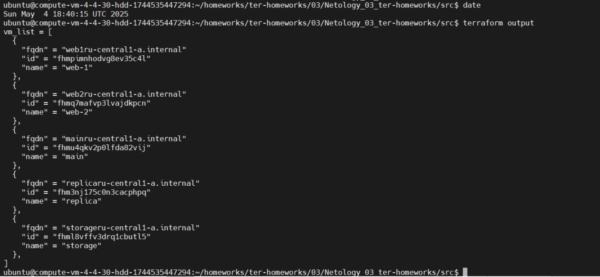

# Домашнее задание к занятию «Управляющие конструкции в коде Terraform»

## Задание 1 - Инициализируйте проект, выполните код.  

1. Ошибка при инициализации проекта, ограничение `~>1.8.4` означает, что **Terraform** должен быть версии `>=1.8.4`, но строго меньше `1.9.0`.   

У меня более новая версия, разрешил свою версию.  
`required_version = ">=1.8.4" # Разрешить использование версий 1.8.4 и выше` 

  

2. Закоментироал подлючение через `OAuth-token`, перевел на аунтивикацию через ключ сервисного аккаунта.  
`service_account_key_file = file("/home/ubuntu/.yc-keys/sa-key.json")`  

3. Инициализировал проект  

**Ответ:**
Скриншот входящих правил «Группы безопасности» в ЛК Yandex Cloud.  


## Задание 2 - Создайте машины через `count loop` и `for_each loop`

**Ответ:**  
Созлал файлы:  
[count-vm.tf](src/count-vm.tf) - создаются машины `web-1` и `web-2` через `count loop`  
[for_each-vm.tf](src/for_each-vm.tf) - создаются машины `main` и `replica` через `for_each loop`  

Машины из файлы `count-vm.tf` создаются после машин из файлы `for_each-vm.tf`, использована зависимость:  
`depends_on = [yandex_compute_instance.db] # Зависимость обеспечивает создание ВМ web после ВМ db`  
В объект `each_vm` в `variables.tf`, добавив дополнительные параметры: `platform_id`, `preemptible`, `core_fraction`, `disk_type` и `nat`.  




## Задание 3 - Подлючение дисков через `count loop`  

1. Создаю файл disk_vm.tf и добавляю 3 одинаковых виртуальных диска с помощью `count loop`.  

- Использую count = 3, чтобы создать три диска.  
- Имена дисков формируются как `extra-disk-1`, `extra-disk-2`, `extra-disk-3` с помощью `count.index + 1`.  
- Задаю размер 1 (ГБ) и тип network-hdd (стандартный сетевой диск).  

2. Создаю одиночную ВМ с именем `storage` без использования `count` или `for_each`   
- Согласно заданию, ВМ должна быть создана как одиночный ресурс (без `count` или `for_each`).  

3. Подключаю дополнительные диски с помощью `dynamic secondary_disk` и `for_each`  
Я использую блок dynamic `secondary_disk` внутри ресурса yandex_compute_instance и мета-аргумент for_each, чтобы подключить три созданных диска.  

**Ответ:**
<details>  
<summary>Код в disk_vm.tf:</summary>  

```sh
# disk_vm.tf
resource "yandex_compute_disk" "extra_disk" {
  count = 3

  name     = "extra-disk-${count.index + 1}" # Имена: extra-disk-1, extra-disk-2, extra-disk-3
  size     = 1                               # Размер 1 ГБ
  type     = "network-hdd"                   # Тип диска
  zone     = var.default_zone                # Зона совпадает с зоной ВМ
}

resource "yandex_compute_instance" "storage" {
  name        = "storage"
  platform_id = "standard-v1"
  zone        = var.default_zone

  resources {
    cores  = 2
    memory = 2
    core_fraction = 20
  }

  boot_disk {
    initialize_params {
      image_id = data.yandex_compute_image.os_image.id
    }
  }
  
  scheduling_policy {
    preemptible = true  # Использую preemptible
  }

  network_interface {
    subnet_id          = yandex_vpc_subnet.develop.id
    nat                = true
    security_group_ids = [yandex_vpc_security_group.example.id]
  }

  dynamic "secondary_disk" {
    for_each = yandex_compute_disk.extra_disk

    content {
      disk_id = secondary_disk.value.id
    }
  }

  metadata = local.full_metadata
}
``` 
</details>

- for_each = yandex_compute_disk.extra_disk итерируется по списку всех трех дисков, созданных ресурсом yandex_compute_disk.extra_disk.
- secondary_disk.value.id берет id каждого диска и подключает его как дополнительный диск к ВМ.
- Terraform автоматически определит, что диски должны быть созданы перед ВМ, так как secondary_disk ссылается на yandex_compute_disk.extra_disk.  



## Задание 4 - Инициализируйте проект, выполните код.

**Ответ:**
4.1. Создаю файл шаблона inventory.tmpl

<summary>Код в inventory.tmpl:</summary>  

```sh
# inventory.tmpl
[webservers]
%{ for vm in webservers ~}
${vm.network_interface.0.nat_ip_address} fqdn=${replace(vm.name, "-", "")}${zone}.internal
%{ endfor ~}

[databases]
%{ for vm in databases ~}
${vm.network_interface.0.nat_ip_address} fqdn=${replace(vm.name, "-", "")}${zone}.internal
%{ endfor ~}

[storage]
${storage.network_interface.0.nat_ip_address} fqdn=${storage.name}${zone}.internal
``` 
</details>

Объяснение шаблона:  
    - `[webservers]`: Цикл for перебирает все ВМ из группы webservers (то есть web-1 и web-2), добавляя их внешние IP (nat_ip_address) и fqdn.   
    - `[databases]`: Цикл for перебирает ВМ из группы databases (main и replica).  
    - `[storage]`: Добавляю одиночную ВМ storage (без цикла, так как она одна).  
    - `fqdn` формируется как <имя_без_дефисов>${zone}.internal, например, web1ru-central1-a.internal.  

4.2. Создаю файл ansible.tf

Использую функцию templatefile для рендеринга шаблона и передаю необходимые данные через переменные:

<summary>Код в ansible.tf:</summary>  

```sh
# ansible.tf

resource "local_file" "ansible_inventory" {
  content = templatefile("${path.module}/inventory.tmpl", {
    webservers = yandex_compute_instance.web
    databases  = values(yandex_compute_instance.db)
    storage    = yandex_compute_instance.storage
    zone       = var.default_zone
  })
  filename = "${path.module}/ansible_inventory.ini"
}
``` 
</details>

**Объяснение:**  
    - `templatefile("${path.module}/inventory.tmpl", {...})`: Читает шаблон из файла `inventory.tmpl`  и подставляет переменные.   
    Переменные, передаваемые в шаблон:  
        - `webservers` = yandex_compute_instance.web: Список ВМ `web-1` и `web-2` (ресурс с count возвращает список).  
        - `databases` = `values(yandex_compute_instance.db)`: Список ВМ main и `replica` (ресурс с `for_each` возвращает мапу, поэтому использую `values()` для получения списка значений).
        - `storage` = yandex_compute_instance.storage: Одиночная ВМ storage.  
        - `zone` = var.default_zone: Зона (`ru-central1-a`), используется для формирования fqdn.  
    `local_file` записывает сгенерированный инвентарь в файл `ansible_inventory.ini`.  

В коде (`ansible.tf`) использую ресурс `local_fil` который eпринадлежит провайдеру `hashicorp/local`, который отвечает за операции с локальной файловой системой (создание/обновление файлов). В связи с этим требуется обновление `.terraform.lock.hcl`.  
`terraform init -upgrade`

**Ответ:**

- Создал файл `ansible.tf` и файл балон отчета `inventory.tmpl`, используя функцию `templatefile` для генерации динамического инвентарного файла `Ansible`, который будет включать группы ВМ из заданий 2.1, 2.2 и 3.2 (всего 5 ВМ: web-1, web-2, main, replica, storage). Также добавил переменную fqdn согласно требованиям.  
- Динамичность: Шаблон поддерживает произвольное количество ВМ, так как циклы %{ for ... %} автоматически обрабатывают все элементы списка yandex_compute_instance.web[*] и yandex_compute_instance.db[*].  




## Задание 5 - Напишите output, который отобразит ВМ из ваших ресурсов count и for_each в виде списка словарей

<summary>Код в outputs.tf:</summary>  

```sh
# outputs.tf

output "vm_list" {
  description = "List of all VMs with name, id, and fqdn"
  value = flatten([
    # ВМ из yandex_compute_instance.web (count)
    [
      for vm in yandex_compute_instance.web : {
        name = vm.name
        id   = vm.id
        fqdn = "${replace(vm.name, "-", "")}${var.default_zone}.internal"
      }
    ],
    # ВМ из yandex_compute_instance.db (for_each)
    [
      for vm in values(yandex_compute_instance.db) : {
        name = vm.name
        id   = vm.id
        fqdn = "${replace(vm.name, "-", "")}${var.default_zone}.internal"
      }
    ],
    # ВМ из yandex_compute_instance.storage (одиночная)
    [
      {
        name = yandex_compute_instance.storage.name
        id   = yandex_compute_instance.storage.id
        fqdn = "${yandex_compute_instance.storage.name}${var.default_zone}.internal"
      }
    ]
  ])
}

``` 
</details>

**Ответ:**

- Создан output "vm_list" в файле outputs.tf, который динамически отображает все ВМ (web-1, web-2, main, replica, storage) в виде списка словарей с полями name, id и fqdn.  
- Код итеративно обрабатывает ресурсы count, for_each и одиночный ресурс.  

Результат выполнения команды `terraform output`:  

